# Alyxnet Frame — Developer Manual

> A comprehensive technical reference for developers building on top of, extending, or contributing to the **Alyxnet Frame** multi-tenant SaaS platform.

---

## Table of Contents

1. [Project Overview](#1-project-overview)
2. [Monorepo Structure](#2-monorepo-structure)
3. [System Architecture](#3-system-architecture)
    - [High-Level Overview](#31-high-level-overview)
    - [Hub vs Silo Runtime Modes](#32-hub-vs-silo-runtime-modes)
    - [Request Lifecycle](#33-request-lifecycle)
4. [Backend Deep Dive](#4-backend-deep-dive)
    - [Middleware Chain](#41-middleware-chain)
    - [Module Gateway](#42-module-gateway)
    - [Data Models](#43-data-models)
    - [Authentication & Authorization](#44-authentication--authorization)
    - [Multi-Tenancy](#45-multi-tenancy)
    - [Real-Time Events](#46-real-time-events)
    - [Background Jobs](#47-background-jobs)
5. [Frontend Deep Dive](#5-frontend-deep-dive)
    - [Folder Structure](#51-folder-structure)
    - [Auth Context & API Client](#52-auth-context--api-client)
    - [Routing](#53-routing)
    - [UI Component System](#54-ui-component-system)
6. [Creating a New Module](#6-creating-a-new-module)
    - [Step-by-Step Guide](#61-step-by-step-guide)
    - [Module Lifecycle](#62-module-lifecycle)
    - [Data Model Conventions](#63-data-model-conventions)
    - [Frontend Integration](#64-frontend-integration)
    - [Swagger Documentation](#65-swagger-documentation)
7. [Existing Modules Reference](#7-existing-modules-reference)
8. [Configuration & Environment](#8-configuration--environment)
9. [Dev Tooling & CI/CD](#9-dev-tooling--cicd)
10. [Security Architecture](#10-security-architecture)
11. [Common Patterns & Best Practices](#11-common-patterns--best-practices)

---

## 1. Project Overview

**Alyxnet Frame** is a production-ready, multi-tenant SaaS platform built on the MERN stack (MongoDB, Express, React, Node.js). It provides:

- **Multi-tenancy** — Isolated data per tenant, enforced at the Mongoose plugin level.
- **Module Marketplace** — Self-contained feature modules that can be purchased per-tenant.
- **Role-Based Access Control** — Owner → Admin → Staff → User hierarchy.
- **Dual Runtime Modes** — Hub (shared control plane) or Silo (dedicated per-tenant instance).
- **Real-Time Events** — Socket.io for live dashboard updates.
- **Automated CI/CD** — Docker + GitHub Actions → AWS Lightsail.

### Tech Stack

| Layer     | Technology                               |
| :-------- | :--------------------------------------- |
| Frontend  | Vite + React 19 + TypeScript + shadcn/ui |
| Backend   | Node.js 22+ / Express 5.x                |
| Database  | MongoDB 6.0+ (via Mongoose 9.x)          |
| Real-time | Socket.io 4.x                            |
| Monorepo  | Turborepo                                |
| Email     | Resend                                   |
| Logging   | Pino                                     |
| API Docs  | Swagger (OpenAPI 3.0)                    |
| Container | Docker + Docker Compose                  |
| CI/CD     | GitHub Actions → AWS Lightsail           |

---

## 2. Monorepo Structure

The project is organized as an **npm workspace monorepo** managed by **Turborepo**.

```
frame/                          ← Root (workspace)
├── package.json                ← Root scripts & workspace definition
├── turbo.json                  ← Turborepo pipeline config
├── docker-compose.yml          ← Multi-service local Docker config
├── Dockerfile                  ← Monolithic production container
│
├── backend/                    ← Express API server (Node.js + TypeScript)
│   ├── server.ts               ← Entry point: DB connect, cron jobs, listen
│   ├── app.js                  ← Express app factory: middleware + route mount
│   ├── config.ts               ← Centralized config from env vars (fail-fast)
│   ├── routes/                 ← Core routes (auth, admin, marketplace, health)
│   ├── middleware/              ← Request pipeline middleware
│   ├── gateway/                ← Module loader, access control, Swagger
│   ├── modules/                ← Pluggable feature modules
│   ├── models/                 ← Mongoose schemas
│   ├── plugins/                ← Mongoose global plugins
│   ├── jobs/                   ← Background cron jobs
│   ├── services/               ← Shared business logic services
│   ├── events/                 ← Event bus (pub/sub for module communication)
│   ├── utils/                  ← Logger, socket, response helpers
│   └── schemas/                ← Zod validation schemas
│
├── frontend/                   ← Vite + React frontend
│   └── src/
│       ├── app.tsx             ← Root component + router
│       ├── pages/              ← Route-level page components
│       ├── components/         ← Reusable UI components (shadcn/ui + custom)
│       ├── contexts/           ← React contexts (auth)
│       ├── hooks/              ← Custom React hooks
│       └── config/             ← URL helpers, env wrappers
│
├── desktop/                    ← Electron wrapper (dev mode only)
└── mobile/                     ← React Native app (planned)
```

### Turborepo Pipeline

```json
// turbo.json
{
    "tasks": {
        "dev": { "cache": false, "persistent": true },
        "build": { "dependsOn": ["^build"] },
        "lint": { "dependsOn": ["^lint"] },
        "test": { "dependsOn": ["^test"] }
    }
}
```

Running `npm run dev` at the root triggers all workspace `dev` scripts in parallel. The frontend (`vite`) and backend (`tsx watch server.ts`) both start concurrently.

---

## 3. System Architecture

### 3.1 High-Level Overview

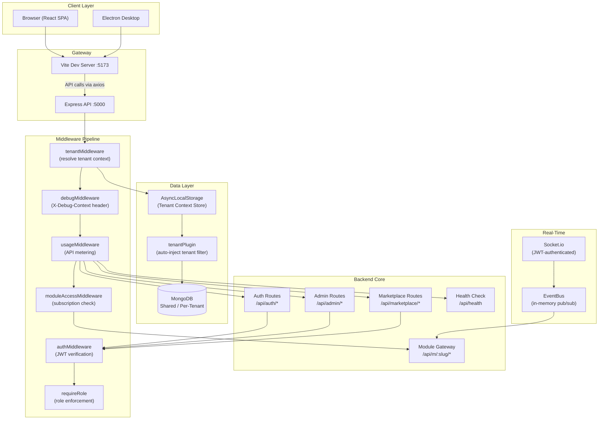

### 3.2 Hub vs Silo Runtime Modes

The framework determines its mode at startup by checking the `APP_TENANT_ID` environment variable.

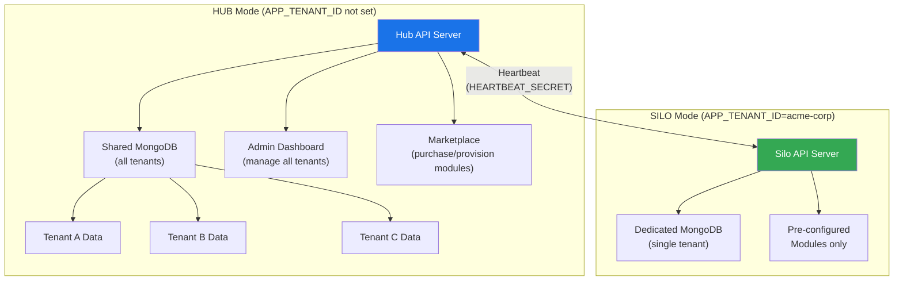

**Tenant Resolution Logic in `tenantMiddleware.js`:**

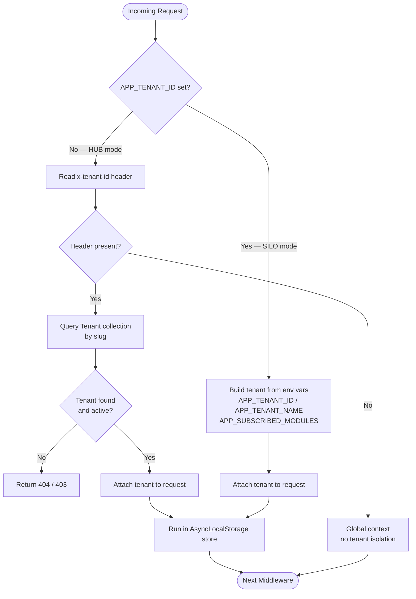

### 3.3 Request Lifecycle

Every API request passes through this exact middleware pipeline in `app.js`:

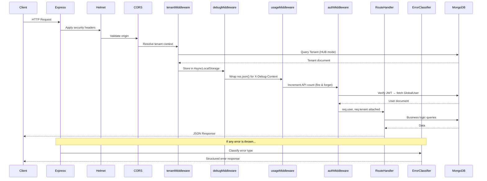

---

## 4. Backend Deep Dive

### 4.1 Middleware Chain

All middleware lives in `backend/middleware/`. Here is the full chain:

| Middleware               | File                                | Purpose                                          |
| :----------------------- | :---------------------------------- | :----------------------------------------------- |
| Helmet                   | (npm)                               | HTTP security headers (CSP, HSTS, etc.)          |
| CORS                     | (npm)                               | Validates `Origin` header against `CORS_ORIGINS` |
| Rate Limiter             | `rateLimiters.js`                   | Per-endpoint request throttling                  |
| `tenantMiddleware`       | `tenantMiddleware.js`               | Resolves tenant from header or env               |
| `debugMiddleware`        | `debugMiddleware.js`                | Injects `X-Debug-Context` for admin users        |
| `usageMiddleware`        | `usageMiddleware.js`                | Meters API calls per tenant per module           |
| `authMiddleware`         | `authMiddleware.js`                 | Verifies JWT, attaches `req.user`                |
| `requireRole`            | `authMiddleware.js`                 | RBAC enforcement (owner > admin > staff > user)  |
| `requireVerifiedEmail`   | `authMiddleware.js`                 | Blocks unverified users                          |
| `validate(schema)`       | `validate.js`                       | Zod schema validation for request bodies         |
| `auditLogger`            | `auditLogger.js`                    | Writes sensitive actions to AuditLog             |
| `moduleAccessMiddleware` | `gateway/moduleAccessMiddleware.js` | Checks tenant subscription for module access     |

#### `authMiddleware.js` — Exported Functions

```javascript
// Verify JWT and attach req.user
const { authMiddleware } = require('../../middleware/authMiddleware');

// Require specific role(s)
const { requireRole } = require('../../middleware/authMiddleware');
router.delete('/:id', authMiddleware, requireRole('admin', 'owner'), handler);

// Require email verification
const { requireVerifiedEmail } = require('../../middleware/authMiddleware');
router.post('/sensitive', authMiddleware, requireVerifiedEmail, handler);
```

#### `validate.js` — Request Validation

```javascript
const { validate } = require('../../middleware/validate');
const { z } = require('zod');

const CreateSchema = z.object({
    name: z.string().min(1).max(100),
    email: z.string().email(),
});

router.post('/', authMiddleware, validate(CreateSchema), async (req, res) => {
    const { name, email } = req.body; // Guaranteed valid by middleware
});
```

#### `auditLogger.js` — Audit Trail

```javascript
const { auditLog } = require('../../middleware/auditLogger');

// Log an action manually in a route handler
await auditLog({
    action: 'tenant.suspend',
    actor: req.user._id,
    targetId: tenant._id,
    details: { reason: 'Payment overdue' },
});
```

### 4.2 Module Gateway

The gateway in `backend/gateway/` is responsible for auto-discovering, loading, and registering all modules:

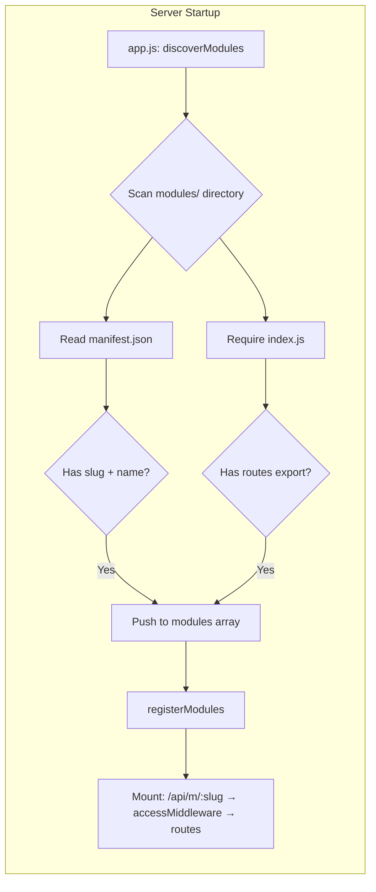

**`moduleAccessMiddleware.js`** — Runs before every module route:

1. Checks `req.tenant.subscribedModules` includes the requested slug.
2. In SILO mode, checks `APP_SUBSCRIBED_MODULES` env var.
3. Returns `403 Forbidden` if the tenant doesn't have the module.

### 4.3 Data Models

All models live in `backend/models/`. Global models are used by the Hub core. Module-specific models are stored inside the module folder.

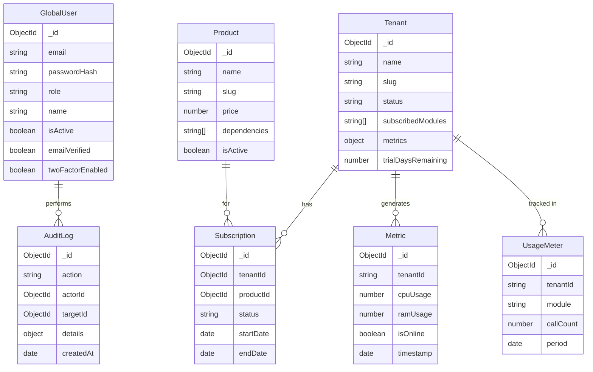

### 4.4 Authentication & Authorization

Frame uses **JWT access tokens** (short-lived, 15 min) and **refresh tokens** (long-lived, 7 days) stored as documents in MongoDB.

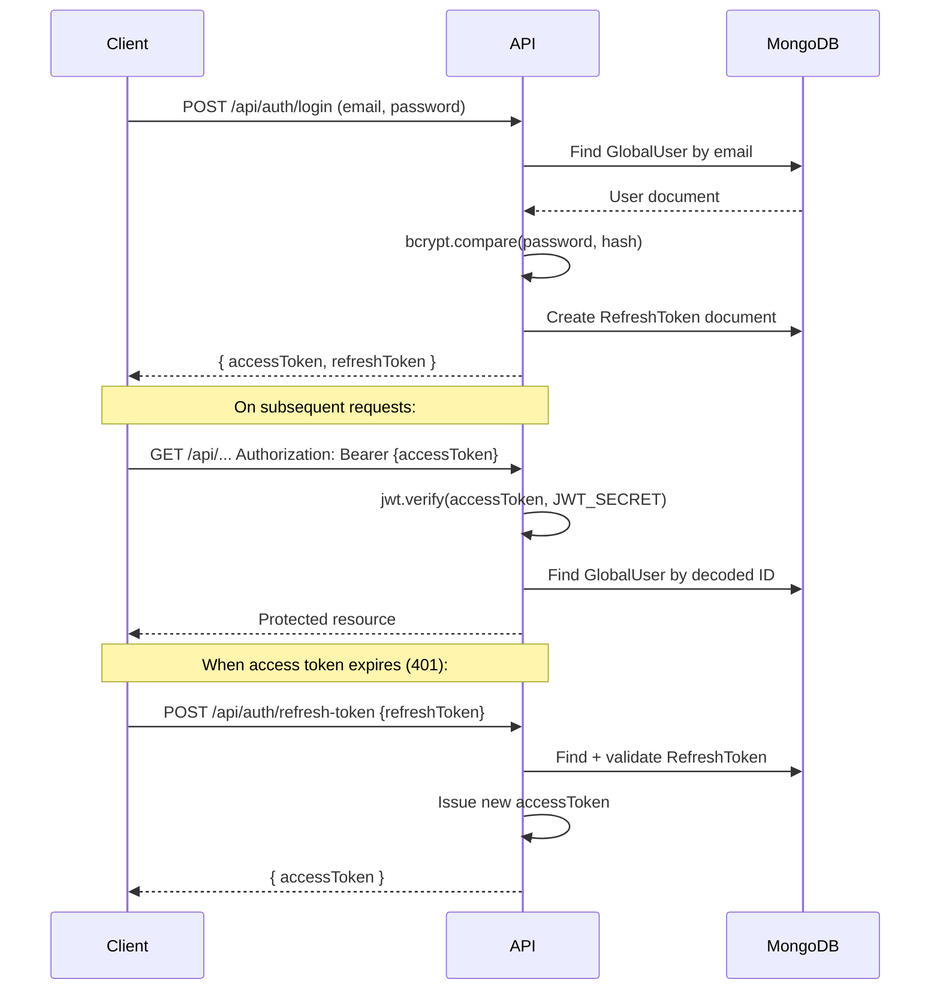

**Role Hierarchy:**

```
owner  (full access, manage users/roles)
  └─ admin  (manage tenants, view audit logs)
       └─ staff  (module-level write access)
            └─ user  (read-only, self-service)
```

### 4.5 Multi-Tenancy

Data isolation is enforced at **two levels**:

**Level 1 — Request Level** (`tenantMiddleware.js`):

- Every request in HUB mode must include `x-tenant-id: {slug}`.
- Middleware queries the Tenant collection, validates status, and attaches `req.tenant`.
- Stores tenant in `AsyncLocalStorage` for downstream access.

**Level 2 — Database Level** (`plugins/tenantPlugin.js`):

- Applied globally via `mongoose.plugin(tenantPlugin)` in `app.js`.
- Automatically injects `{ tenant: currentTenantId }` into all Mongoose queries on schemas that have a `tenant` field.
- Prevents cross-tenant data leaks even if a route handler forgets to filter.

```javascript
// Bypass for admin/system queries:
await MyModel.find({}).setOptions({ skipTenantCheck: true });
```

### 4.6 Real-Time Events

**Socket.io** is initialized in `utils/socket.js` and authenticated via JWT:

```javascript
// Client connection (frontend)
const socket = io('http://localhost:5000', {
    auth: { token: accessToken },
});

// Listen for module events
socket.on('module.provisioned', ({ tenantSlug, moduleSlug }) => {
    console.log(`${moduleSlug} provisioned for ${tenantSlug}`);
});
```

**EventBus** (`events/EventBus.js`) is an in-memory pub/sub system for module-to-module communication:

```javascript
// In a module route handler
req.eventBus.emit('crm:lead.created', { tenantId, leadId });

// In another module that subscribes
eventBus.on('crm:lead.created', async ({ tenantId, leadId }) => {
    // React to the event
});
```

### 4.7 Background Jobs

Jobs in `backend/jobs/` are cron-scheduled tasks:

| Job           | File              | Schedule          | Purpose                                 |
| :------------ | :---------------- | :---------------- | :-------------------------------------- |
| Token Cleanup | `tokenCleanup.js` | Daily 03:00       | Delete expired RefreshToken documents   |
| Backup        | `backup.js`       | Configurable      | Run MongoDB dump + upload to provider   |
| Trial Cleanup | `trialCleanup.js` | Daily             | Suspend tenants whose trial has expired |
| Seed Admin    | `seedAdmin.js`    | On startup (once) | Create default owner account            |

---

## 5. Frontend Deep Dive

### 5.1 Folder Structure

```
frontend/src/
├── main.tsx            ← React DOM render, wrap with providers
├── app.tsx             ← React Router v7 route definitions
├── index.css           ← Global CSS + Tailwind v4 tokens
│
├── pages/              ← One file per route
│   ├── login.tsx
│   ├── dashboard.tsx   ← Fleet overview + metrics
│   ├── tenants.tsx     ← Tenant CRUD
│   ├── users.tsx       ← User management
│   ├── marketplace.tsx ← Module store
│   ├── audit-logs.tsx
│   └── settings.tsx
│
├── components/
│   ├── ui/             ← shadcn/ui primitives (button, card, dialog, etc.)
│   ├── app-sidebar.tsx ← Navigation sidebar
│   ├── debug-panel.tsx ← X-Debug-Context overlay (admin only)
│   └── ...
│
├── contexts/
│   └── auth-context.tsx ← AuthProvider: user state, tokens, axios instance
│
├── hooks/
│   ├── use-auth.tsx    ← useAuth() → { user, login, logout, ... }
│   ├── use-toast.tsx   ← useToast() → toast notifications
│   └── use-socket.tsx  ← useSocket() → real-time connection
│
└── config/
    └── urls.ts         ← getBackendUrls() → { api, socket }
```

### 5.2 Auth Context & API Client

The `AuthContext` in `contexts/auth-context.tsx` is the central hub for:

- **User state** (`user`, `loading`)
- **Token management** (store in `localStorage`, auto-refresh)
- **Axios instance** pre-configured with the backend URL and interceptors

```typescript
// Access in any component:
import { useAuth } from '@/hooks/use-auth';

function MyComponent() {
    const { user, api, logout } = useAuth();

    const fetchData = async () => {
        // api is the pre-configured Axios instance with Authorization header
        const res = await api.get('/admin/tenants');
        console.log(res.data.data);
    };
}
```

**Axios Interceptors:**

- **Request**: Automatically attaches `Authorization: Bearer {accessToken}`.
- **Response (401)**: Automatically calls `/api/auth/refresh-token`, retries the original request. If refresh fails, calls `logout()`.

### 5.3 Routing

All routes are defined in `app.tsx` using React Router v7. Protected routes wrap content in a `PrivateRoute` component that checks `useAuth().user`.

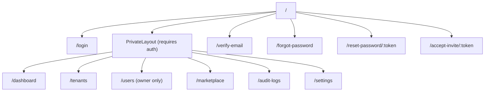

### 5.4 UI Component System

The frontend uses **shadcn/ui** components (built on Radix UI primitives + Tailwind CSS v4).

> **Important Import Pattern**: Always use namespace imports for Radix UI:
>
> ```typescript
> // ✅ Correct
> import * as Slot from '@radix-ui/react-slot';
> const Comp = asChild ? Slot.Root : 'div';
>
> // ❌ Wrong — causes runtime errors
> import { Slot } from '@radix-ui/react-slot';
> const Comp = asChild ? Slot.Root : 'div'; // Slot.Root is undefined!
> ```

---

## 6. Creating a New Module

Modules are the primary extension point of the framework. Each module is a self-contained Express app with its own models, routes, and provisioning logic.

### 6.1 Step-by-Step Guide

#### Step 1: Copy the Template

```bash
cp -r backend/modules/_template backend/modules/my-feature
```

Your new module directory structure:

```
backend/modules/my-feature/
├── index.js          ← Module manifest + lifecycle hooks
├── routes.js         ← Express routes (auto-mounted at /api/m/my-feature/)
├── models/           ← (create this) Mongoose models for your module
│   └── MyModel.js
├── swagger.js        ← (optional) OpenAPI spec for your module
└── manifest.json     ← (create this) Module metadata
```

#### Step 2: Create the manifest.json

```json
{
    "name": "My Feature",
    "slug": "my-feature",
    "version": "1.0.0",
    "description": "What this module does in one sentence.",
    "category": "productivity",
    "dependencies": [],
    "trialDays": 14,
    "price": 0
}
```

> **Note**: `slug` must be **URL-safe**, **lowercase**, with **hyphens** (e.g., `my-feature`). It must match the folder name exactly.

#### Step 3: Update index.js

```javascript
// backend/modules/my-feature/index.js
const routes = require('./routes');

module.exports = {
    name: 'My Feature',
    slug: 'my-feature',
    version: '1.0.0',
    description: 'Short description of what this module does.',
    routes,

    /**
     * Called once when a tenant purchases/activates this module.
     * Use this to seed initial data, create indexes, etc.
     * @param {Object} tenant - The Tenant Mongoose document
     * @param {Object} logger - Pino logger instance
     */
    onProvision: async (tenant, logger) => {
        logger.info({ tenant: tenant.slug }, 'Provisioning my-feature module');

        // Example: Seed default settings for this tenant
        // const MyModel = require('./models/MyModel');
        // await MyModel.create({ tenant: tenant._id, key: 'default' });
    },
};
```

#### Step 4: Create Your Routes

```javascript
// backend/modules/my-feature/routes.js
const express = require('express');
const router = express.Router();
const { authMiddleware, requireRole } = require('../../middleware/authMiddleware');
const { validate } = require('../../middleware/validate');
const { successResponse, errorResponse } = require('../../utils/responseWrapper');
const { z } = require('zod');

// Zod schemas for validation
const CreateItemSchema = z.object({
    name: z.string().min(1).max(100),
    description: z.string().optional(),
});

// GET /api/m/my-feature/items
router.get('/items', authMiddleware, async (req, res, next) => {
    try {
        // req.tenant is available here (tenant context)
        // req.user is the authenticated user
        const MyModel = require('./models/MyModel');
        const items = await MyModel.find({}); // tenantPlugin auto-filters by tenant
        return successResponse(res, items);
    } catch (err) {
        next(err); // Pass to error classifier
    }
});

// POST /api/m/my-feature/items
router.post(
    '/items',
    authMiddleware,
    requireRole('admin', 'owner'),
    validate(CreateItemSchema),
    async (req, res, next) => {
        try {
            const MyModel = require('./models/MyModel');
            const item = await MyModel.create({
                ...req.body,
                tenant: req.tenant._id, // Always set the tenant
            });
            return successResponse(res, item, 'Item created', 201);
        } catch (err) {
            next(err);
        }
    },
);

module.exports = router;
```

#### Step 5: Create Your Mongoose Model

```javascript
// backend/modules/my-feature/models/MyModel.js
const mongoose = require('mongoose');

const MyModelSchema = new mongoose.Schema(
    {
        // REQUIRED: tenant field for data isolation
        tenant: {
            type: mongoose.Schema.Types.ObjectId,
            ref: 'Tenant',
            required: true,
            index: true,
        },
        name: { type: String, required: true, maxlength: 100 },
        description: { type: String },
        isActive: { type: Boolean, default: true },
    },
    { timestamps: true },
);

// The tenantPlugin (registered globally in app.js) will automatically
// inject `{ tenant: currentTenantId }` into all queries on schemas
// that have a `tenant` field — so you get isolation for free.

module.exports = mongoose.models.MyModel || mongoose.model('MyModel', MyModelSchema);
```

#### Step 6: Register in Marketplace

Add the module to the Marketplace so tenants can discover and purchase it:

```bash
# Via API (POST /api/marketplace/products) as an owner/admin:
curl -X POST http://localhost:5000/api/marketplace/products \
  -H "Authorization: Bearer <token>" \
  -H "Content-Type: application/json" \
  -d '{
    "name": "My Feature",
    "slug": "my-feature",
    "description": "Short description.",
    "price": 0,
    "features": ["Feature A", "Feature B"],
    "dependencies": []
  }'
```

Or create it via the Admin Dashboard → Marketplace → Create Product.

#### Step 7: Restart the Server

The gateway auto-discovers new modules on startup:

```
[INFO] Module discovered: my-feature v1.0.0
[INFO] Module routes registered: /api/m/my-feature
```

### 6.2 Module Lifecycle

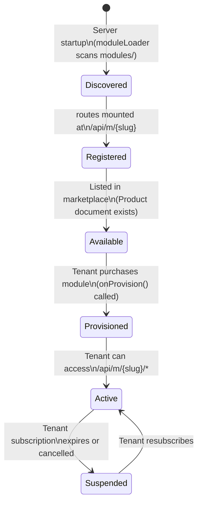

**Provisioning Flow:**

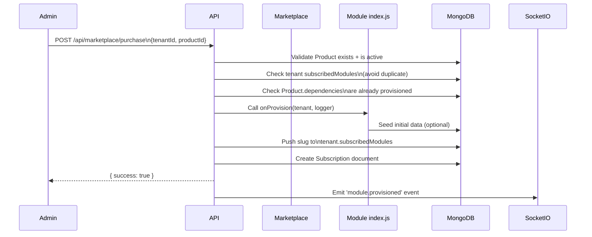

### 6.3 Data Model Conventions

All module models **must** follow these conventions:

| Convention           | Rule                                | Reason                                         |
| :------------------- | :---------------------------------- | :--------------------------------------------- |
| `tenant` field       | Required `ObjectId` ref to `Tenant` | Enables automatic isolation via `tenantPlugin` |
| `timestamps: true`   | Always enable                       | Provides `createdAt` / `updatedAt`             |
| Soft delete          | Use `isActive: Boolean`             | Preserve history, allow restore                |
| Index `tenant` field | `index: true`                       | Performance for multi-tenant queries           |
| Unique constraints   | Compound: `{ tenant, field }`       | Uniqueness per-tenant, not global              |

**Example compound unique index:**

```javascript
MyModelSchema.index({ tenant: 1, email: 1 }, { unique: true });
```

### 6.4 Frontend Integration

To add a UI for your module, create a new page component:

```typescript
// frontend/src/pages/my-feature.tsx
import { useAuth } from '@/hooks/use-auth';
import { useEffect, useState } from 'react';

export default function MyFeaturePage() {
    const { api } = useAuth();
    const [items, setItems] = useState([]);

    useEffect(() => {
        api.get('/m/my-feature/items').then(res => {
            setItems(res.data.data);
        });
    }, []);

    return (
        <div>
            {items.map(item => (
                <div key={item._id}>{item.name}</div>
            ))}
        </div>
    );
}
```

Then add the route in `app.tsx`:

```typescript
// In the protected routes section of app.tsx
import MyFeaturePage from '@/pages/my-feature';

<Route path="/my-feature" element={<MyFeaturePage />} />
```

And add a navigation link in `app-sidebar.tsx`.

### 6.5 Swagger Documentation

Add OpenAPI documentation for your module by creating a `swagger.js` file:

```javascript
// backend/modules/my-feature/swagger.js
module.exports = {
    openapi: '3.0.0',
    info: { title: 'My Feature Module', version: '1.0.0' },
    paths: {
        '/api/m/my-feature/items': {
            get: {
                summary: 'List all items',
                tags: ['My Feature'],
                security: [{ bearerAuth: [] }],
                responses: {
                    200: {
                        description: 'List of items',
                        content: {
                            'application/json': {
                                schema: {
                                    type: 'object',
                                    properties: {
                                        success: { type: 'boolean' },
                                        data: { type: 'array' },
                                    },
                                },
                            },
                        },
                    },
                },
            },
        },
    },
};
```

Then reference it in your `index.js`:

```javascript
module.exports = {
    // ...
    swaggerSpec: require('./swagger'),
};
```

---

## 7. Existing Modules Reference

### Billing & Subscriptions (`/api/m/billing/`)

Handles Razorpay payment integration, subscription lifecycle, and webhook processing.

| Endpoint             | Method | Description                          |
| :------------------- | :----- | :----------------------------------- |
| `/billing/plans`     | GET    | List available plans                 |
| `/billing/subscribe` | POST   | Initiate Razorpay checkout           |
| `/billing/webhooks`  | POST   | Razorpay webhook receiver (raw body) |
| `/billing/status`    | GET    | Current subscription status          |

**Dependencies**: None

### CRM (`/api/m/crm/`)

Customer Relationship Management with lead tracking.

| Endpoint         | Method           | Description       |
| :--------------- | :--------------- | :---------------- |
| `/crm/leads`     | GET/POST         | List/create leads |
| `/crm/leads/:id` | GET/PATCH/DELETE | Manage a lead     |

**Dependencies**: None

### Hotel Management (`/api/m/hotel/`)

Full hotel property management system (v2.0.0).

Key resources: Rooms, Customers, Bookings, Services, Agents, Transactions, Invoices, Housekeeping.

**Dependencies**: None

---

## 8. Configuration & Environment

All configuration is centralized in `backend/config.ts`. The server will **refuse to start** if required variables are missing.

### Required Variables

| Variable     | Description                                                         |
| :----------- | :------------------------------------------------------------------ |
| `JWT_SECRET` | Secret for signing access tokens. Must be cryptographically random. |

### Full Reference

| Variable                 | Default                              | Description                           |
| :----------------------- | :----------------------------------- | :------------------------------------ |
| `PORT`                   | `5000`                               | Backend port                          |
| `NODE_ENV`               | `development`                        | `development` / `production` / `test` |
| `MONGODB_URI`            | `mongodb://localhost:27017/mern-app` | MongoDB connection string             |
| `JWT_EXPIRY`             | `15m`                                | Access token lifetime                 |
| `REFRESH_TOKEN_EXPIRY`   | `7d`                                 | Refresh token lifetime                |
| `HEARTBEAT_SECRET`       | —                                    | Fleet Manager authentication key      |
| `RESEND_API_KEY`         | —                                    | Email service key                     |
| `CORS_ORIGINS`           | `http://localhost:5173,...`          | Comma-separated allowed origins       |
| `APP_TENANT_ID`          | —                                    | **Set to enable SILO mode**           |
| `APP_SUBSCRIBED_MODULES` | —                                    | Comma-separated slugs (SILO mode)     |
| `BACKUP_ENABLED`         | `false`                              | Enable automated backups              |
| `BACKUP_PROVIDER`        | `local`                              | `local` / `s3` / `gdrive`             |
| `LOG_LEVEL`              | `info`                               | Pino log level                        |

### Generating Secrets

```bash
# JWT_SECRET — 64 bytes of entropy
node -e "console.log(require('crypto').randomBytes(64).toString('hex'))"

# HEARTBEAT_SECRET — 32 bytes
node -e "console.log(require('crypto').randomBytes(32).toString('hex'))"
```

---

## 9. Dev Tooling & CI/CD

### Local Development

```bash
# Start everything (frontend + backend + desktop)
npm run dev

# Backend only
npm run dev --workspace=backend

# Frontend only
npm run dev --workspace=frontend

# Run all tests
npm run test

# Lint all packages
npm run lint

# Format all files
npm run format
```

### CI/CD Pipeline (`.github/workflows/`)

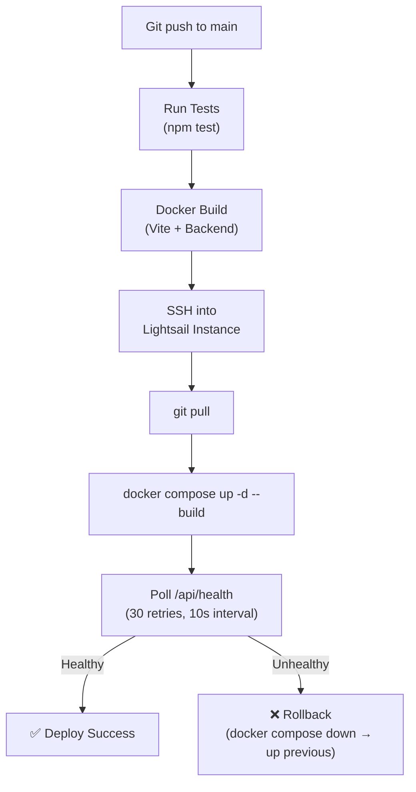

### Port Conflict Resolution

If `npm run dev` fails with `EADDRINUSE`:

```bash
# Find the process using port 5000
netstat -ano | findstr LISTENING | findstr :5000

# Kill it (replace PID with actual PID)
tskill {PID}

# Same for port 5173 (frontend)
netstat -ano | findstr LISTENING | findstr :5173
tskill {PID}
```

---

## 10. Security Architecture

### Authentication

- **JWT access tokens** (15 min lifetime) stored in `localStorage`.
- **Refresh tokens** (7 day lifetime) stored as MongoDB documents (revocable).
- **Token rotation**: On refresh, the old refresh token is invalidated.

### Data Isolation (CSRF Safety)

The application uses `Authorization: Bearer` headers instead of cookies, which provides inherent CSRF protection — cross-origin pages cannot forge requests that include the Bearer token.

> ⚠️ The tradeoff is XSS exposure. Helmet's CSP headers and strict input validation mitigate this.

### Rate Limiting

All auth endpoints are rate-limited. Values are much more permissive in development (`NODE_ENV=development`).

| Endpoint Group  | Production Limit | Window |
| :-------------- | :--------------- | :----- |
| Auth (general)  | 20 req           | 15 min |
| Login           | 10 req           | 15 min |
| Register        | 5 req            | 15 min |
| Forgot Password | 5 req            | 15 min |

### CORS

Only origins listed in `CORS_ORIGINS` are allowed. The middleware logs and blocks unknown origins with a `403` response.

### Input Validation

All body inputs are validated with **Zod schemas** via the `validate(schema)` middleware before reaching route handlers.

---

## 11. Common Patterns & Best Practices

### Response Format

Always use `responseWrapper.js` for consistent API responses:

```javascript
const { successResponse, errorResponse } = require('../../utils/responseWrapper');

// Success
return successResponse(res, data, 'Optional message', 200);
// → { success: true, data: {...}, message: 'Optional message' }

// Error
return errorResponse(res, 'Something went wrong', 400);
// → { success: false, message: 'Something went wrong' }
```

### Error Handling

Never send raw errors to the client. Always use `next(err)`:

```javascript
router.get('/items', authMiddleware, async (req, res, next) => {
    try {
        const items = await MyModel.find({});
        return successResponse(res, items);
    } catch (err) {
        next(err); // ← The errorClassifier middleware handles it
    }
});
```

### Avoiding Common Mistakes

| ❌ Mistake                                    | ✅ Correct Approach                                                        |
| :-------------------------------------------- | :------------------------------------------------------------------------- |
| Forgetting `next(err)` in async routes        | Always wrap in `try/catch` and call `next(err)`                            |
| Missing `tenant` field in model               | Always include `tenant: { type: ObjectId, required: true }`                |
| Calling `mongoose.model()` without guard      | Use `mongoose.models.MyModel \|\| mongoose.model(...)`                     |
| Global uniqueness constraint                  | Use compound index `{ tenant: 1, field: 1 }`                               |
| Hardcoding secrets                            | Use `config.ts` / env vars only                                            |
| Forgetting `skipTenantCheck` on admin queries | Use `.setOptions({ skipTenantCheck: true })` for cross-tenant aggregations |

### Logging

Use the shared logger (Pino), never `console.log` in production code:

```javascript
const logger = require('../../utils/logger');

logger.info({ tenantSlug: tenant.slug }, 'Tenant provisioned');
logger.warn({ err }, 'Non-critical issue');
logger.error({ err, context }, 'Critical failure');
```

### Testing

Tests live in `backend/tests/`. Each file uses `mongodb-memory-server` for an isolated in-memory database.

```bash
# Run all tests
npm run test --workspace=backend

# Run a specific test file
npx jest tests/my-feature.test.js --runInBand
```

**Test Setup Pattern:**

```javascript
const { MongoMemoryServer } = require('mongodb-memory-server');
const mongoose = require('mongoose');
const { createApp } = require('../app');
const request = require('supertest');

let mongoServer, app;

beforeAll(async () => {
    mongoServer = await MongoMemoryServer.create();
    await mongoose.connect(mongoServer.getUri());
    ({ app } = createApp());
});

afterAll(async () => {
    await mongoose.disconnect();
    await mongoServer.stop();
});
```

---

_This manual covers the Alyxnet Frame platform as of **February 2026**. For deployment and user-facing documentation, see [DOCS.md](./DOCS.md)._
