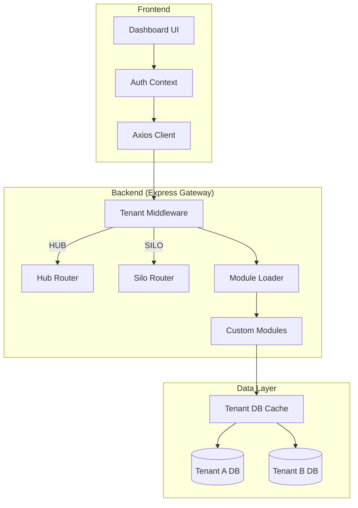

A full-stack monorepo featuring a Dashboard (Vite + React + shadcn/ui), Desktop App (Electron), Mobile App (React Native/Expo), and a Backend (Express + MongoDB).

---

## Project Status: Phase 2 (Business Engine) — In Progress

- **Phase 1 (Foundation)**: 100% Complete
- **Phase 1.5 (Hardening)**: 100% Complete
- **Phase 2 (Business Engine)**: In Progress
    - Hotel Management Module v2.0.0 — Complete

### Current Platform Statistics

| Metric                     | Value      |
| :------------------------- | :--------- |
| **Total Registered Users** | 0          |
| **Active Tenants**         | 0          |
| **Collected Metrics**      | 0          |
| **System Uptime**          | ~0h        |
| **Last Audit**             | 2026-02-16 |

---

## Project Structure

```text
/
├── backend/       # Node.js Express server with MongoDB
├── frontend/      # Vite + React + TypeScript + shadcn/ui dashboard
├── desktop/       # Electron wrapper for the frontend
├── mobile/        # React Native (Expo) mobile application
├── Dockerfile     # Monolithic container definition
└── package.json   # Root script manager
```

## Architecture Overview

Alyxnet Frame utilizes a **Hub-Silo** multi-tenant architecture designed for scalability and data isolation.



## Architecture Checklist: Hub vs Silo

Alyxnet Frame supports two runtime modes for flexible multi-tenant scalability.

### **Hub Mode (Control Plane)**

- **Role**: Central management layer for all tenants.
- **Identity**: Uses `x-tenant-id` header to route requests to dynamic tenant databases.
- **Registry**: Manages `GlobalUser` accounts and `Marketplace` products.
- **Config**: Comment out or remove `APP_TENANT_ID` in `.env`.

### **Silo Mode (Dedicated Instance)**

- **Role**: Standalone instance for a single high-priority tenant.
- **Identity**: Fixed via `APP_TENANT_ID` env variable.
- **DB**: Connects directly to a specific tenant MongoDB.
- **Heartbeat**: Periodically reports health metrics back to the Hub via `backend/scripts/heartbeat-client.js`.
- **Config**: Set `APP_TENANT_ID`, `APP_TENANT_NAME`, and `APP_SUBSCRIBED_MODULES`.

### Core Concepts

- **Hub Mode**: Central control plane for global management and multi-tenant routing.
- **Silo Mode**: Dedicated instances for isolated, high-performance tenant environments.
- **Isolated Multi-Tenancy**: Every tenant has a dedicated MongoDB database, managed dynamically via connection pooling.
- **Modular Plugin System**: Features (like the Hotel module) are auto-discovered and namespaced under `/api/m/`.

## Getting Started

### 1. Simultaneous Run (Recommended)

You can start the Backend and Frontend together from the root directory:

```bash
npm install
npm run dev
```

_This starts the Backend (5000) and Frontend dev server (5173)._

---

### 2. Manual Run

If you need to run specific parts:

**Backend**

```bash
cd backend
npm install
node server.js
```

**Frontend (Development)**

```bash
cd frontend
npm install
npm run dev
```

**Desktop (Electron Development)**

```bash
# First, start the frontend dev server, then:
cd desktop
npm install
npm start
```

**Desktop (Electron Production)**

```bash
# Build the frontend first
cd frontend
npm run build

# Then start Electron in production mode
cd ../desktop
NODE_ENV=production npm start
```

**Mobile (Expo)**

```bash
cd mobile
npm install
npx expo start
```

---

### 3. Docker & Production Deployment

The application is configured for automated deployment to **AWS Lightsail** using a monolithic Docker container.

#### **Local Docker Run**

```bash
# Build and run locally
docker compose up -d --build
```

## Production Deployment (AWS Lightsail)

The deployment is fully automated via **GitHub Actions** with health-check-based rollback support.

### **1. Required GitHub Secrets**

Set these in **Settings > Secrets and variables > Actions**:

- `LIGHTSAIL_HOST`: Your instance public IP.
- `LIGHTSAIL_USERNAME`: `ubuntu`.
- `LIGHTSAIL_SSH_KEY`: Content of your `.pem` private key.

### **2. Server-Side Configuration**

SSH into your Lightsail instance and create `~/frame/backend/.env`:

```env
PORT=5000
NODE_ENV=production
MONGODB_URI=mongodb://localhost:27017/mern-app
JWT_SECRET=your-secure-64-char-secret
HEARTBEAT_SECRET=your-secure-32-char-key
RESEND_API_KEY=re_your-key
```

### **3. CI/CD Workflow**

Pushing to `main` triggers the [deploy.yml](.github/workflows/deploy.yml) workflow which:

- Snapshots the current image as `:rollback`.
- Rebuilds and starts the container.
- Polls `GET /api/health` for 10 minutes.
- Auto-rolls back if health checks fail.

## Environment Variables

- **Backend**: Uses `.env` for `PORT` and `MONGODB_URI`.
- **Frontend**:
    - **Development**: Uses `.env.development` (Connects to `localhost:5000`).
    - **Production**: Uses `.env.production` (Connects to `http://13.232.95.78:5000`).
- **Docker**: Automatically connects to the internal `mongod` instance and persists data in the `mongodb_data` volume.

## Recent Updates

### Hotel Management Module v2.0.0 (2026-02-16)

The `hotel` module (`backend/modules/hotel/`) has been upgraded from a basic Room/Guest/Booking system to a full lodge booking solution. Key changes:

**New Models:** Customer (replaces Guest), Service, Agent, BookingService, Transaction, TransactionCategory, BusinessInfo, Settings, Counter

**Enhanced Models:**

- **Booking** — Auto-calculated `checkOutDate`, `roomRent`, and `checkInNumber` (format: `CHK-YYYYMMDD-NNNN`). New fields: `numberOfDays`, `serviceType` (24h/12h/12PM), `checkInType` (Walk In/Online), guest counts, agent reference, `purposeOfVisit`, `advanceAmount`.
- **Room** — `type` field is now a free string validated against configurable Settings picklist (no longer a hardcoded enum).

**New Backend Route Groups (11 files in `routes/` directory):**

- `/m/hotel/rooms` — Room CRUD
- `/m/hotel/customers` — Customer CRUD (replaces `/guests`)
- `/m/hotel/bookings` — Enhanced booking lifecycle with auto-calculations
- `/m/hotel/bookings/:bookingId/services` — Booking service line items
- `/m/hotel/services` — Billable service catalog
- `/m/hotel/agents` — Travel agent management
- `/m/hotel/settings` — Configurable picklists (room types, ID proof types, etc.)
- `/m/hotel/business-info` — Organization/lodge details (singleton)
- `/m/hotel/transactions` — Financial transactions with filtering
- `/m/hotel/transaction-categories` — Expense/Income categories

**Frontend Dashboard Tabs (grouped):**

- Operations: Overview, Rooms, Customers, Bookings
- Finance: Services, Transactions, Categories
- Admin: Agents, Business Info, Settings

**RBAC:** Settings, BusinessInfo, Services, Agents, Room writes, and Transaction deletes restricted to `admin`/`owner` roles.

**Infrastructure:**

- `getModels.js` — Centralized model factory for tenant-scoped DB connections
- `helpers.js` — Atomic check-in number generation and checkout date calculation
- `onProvision` — Seeds default Settings (roomType, idProofType, purposeOfVisit) on module activation

## Contributing

1.  Make sure Docker is running if you want to test the container.
2.  Ensure port 3000 and 5000 are free before running `npm run dev`.
